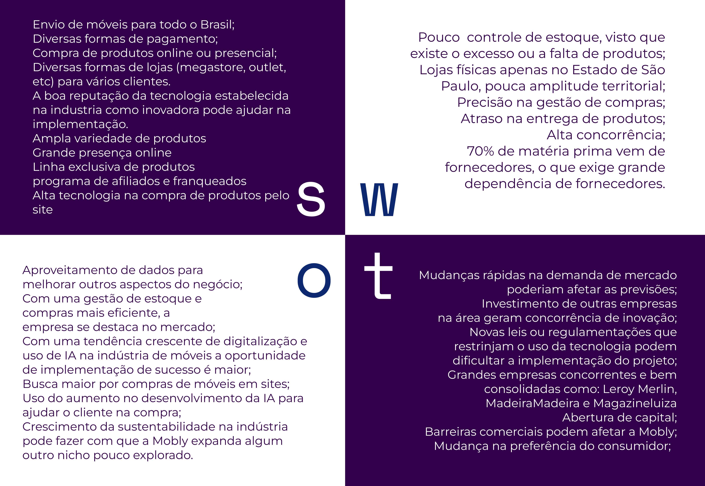

# Documentação Modelo Preditivo - Inteli

```
INSTRUÇÕES GERAIS (remova este trecho ao final)

Você deve editar este documento utilizando notação markdown - siga as convenções neste link 
https://docs.github.com/en/get-started/writing-on-github/getting-started-with-writing-and-formatting-on-github/basic-writing-and-formatting-syntax
```

## Nome da Solução
### Deepmind
#### Ana Luisa Goes Barbosa, Keylla Cristina Oliveira Bispo, Lucas Rego, Luiz Fernando Haddad Saad Villaça Leão, Thiago Goulart de Oliveira, Yan Mendonça Coutinho

## Sumário
[1. Introdução](#c1)

[2. Objetivos e Justificativa](#c2)

[3. Metodologia](#c3)

[4. Desenvolvimento e Resultados](#c4)

[5. Conclusões e Recomendações](#c5)

[6. Referências](#c6)

[Anexos](#attachments)


## <a name="c1"></a>1. Introdução

Fundada por Victor Noda e Marcelo Marques, a Mobly nasceu em 2011 [1]. Ao longo dos anos, tornou-se referência e uma das maiores varejistas online de móveis do Brasil, sua sede está localizada em São Paulo e é considerada uma empresa de grande porte, com um amplo catálogo de produtos e uma presença significativa em seu mercado.

A empresa se destaca por oferecer grande variedade de produtos, com uma vasta gama de estilos e preços, o que a torna uma opção atraente para os clientes. Além disso, a Mobly tem investido em tecnologia e logística para proporcionar uma experiência de compra online mais eficiente e satisfatória.

Como uma das líderes do setor de móveis e decoração no Brasil, enfrenta concorrência de outras empresas do mesmo segmento, tanto varejistas online quanto físicas. Para se manter relevante no mercado altamente competitivo, a empresa foca em manter um bom relacionamento com os clientes, oferecendo um atendimento de qualidade e buscando inovações para melhorar a experiência de compra.

O problema apresentado está no algoritmo de recompra da empresa, que utiliza base histórica para sugerir compra de produtos ao estoque. Atualmente, por diversos motivos, o algoritmo não é muito eficiente, resultando em produtos com baixo giro e algumas vezes ruptura (falta do produto). 

Portanto, o trabalho da equipe Deepmind é criar um modelo preditivo baseado nos dados apresentados que supra essa ineficiência e, assim, tornar o estoque mais otimizado e minimizando perdas.

## <a name="c2"></a>2. Objetivos e Justificativa
### 2.1 Objetivos

O objetivo deste projeto é desenvolver um modelo preditivo para prever com precisão as vendas da empresa num horizonte de 90 dias, sendo assim, podemos separá-los em objetivos gerais e específicos:

**Geral:**

Desenvolver um algoritmo que consiga explorar outras variáveis, algumas externas, baseadas em consumo mas também em intenção, como momento de compra, cenário macroeconômico, Google Trends, valor do dólar, tempo de importação e afins para prever quais e quantos produtos vender.

**Específicos:** 

• Aprimorar a projeção de vendas futuras de forma precisa e detalhada

Tornando possível prever a demanda por SKU e dia específico em um horizonte de 90 dias. O modelo será executado diariamente, permitindo que a equipe de Supply Chain faça compras adequadas.

• Criar um modelo capaz de aprender de maneira generalista

A ideia é criar um modelo que consiga aprender com os dados e ser generalista, não gerando over/underfitting.

• Atingir os critérios de validação

Como critério de validação, serão utilizadas duas métricas principais: a quantidade de vendas por SKU por dia, buscando uma acurácia mínima de 70% e a quantidade de vendas por SKU por semana, visando uma acurácia superior a 90%.

### 2.2 Proposta de solução

O objetivo do nosso modelo é prever num horizonte de 90 dias as vendas por SKU da Mobly, temos como requisitos mínimos de sucesso 70% de acurácia por dia, e 90% ou mais por semana. Além de considerar os dados oferecidos pelo parceiro, também pretendemos enriquecer o modelo com informações externas que impactam diretamente na compra e venda de produtos da empresa, como o valor do dólar, tempo de importação, sazonalidade e demanda. 

### 2.3 Justificativa

Nossa proposta de solução visa ser inovadora, reconhecendo a necessidade de aprimorar a projeção de vendas, nosso modelo não apenas utiliza históricos de consumo, mas também incorpora variáveis externas cruciais, como intenção de compra, valor do dólar, tempo de importação, cenário macroeconômico e sazonalidade. Isso nos diferencia, pois abordamos o problema de forma mais abrangente e adaptável, permitindo previsões mais precisas em um mercado volátil.

A necessidade do projeto surgiu de uma ineficácia na operação da Mobly, a qual gera ruptura na quantidade de produtos em estoque ou a sobra do mesmo, prejudicando as vendas e experiência de compra do cliente. Considerando o cenário proposto, a empresa junto com o Inteli entendeu que uma solução de modelo preditivo seria o melhor caminho para solucionar o problema, com base nisso desenvolvemos nossa proposta. 


## <a name="c3"></a>3. Metodologia
O nosso projeto foi estruturado com base na metodologia CRISP-DM (Cross Industry Standard Process for Data Mining). Essa é uma abordagem presente na metodologia ágil, amplamente empregada em iniciativas que exploram o universo do Data Science e Machine Learning, especialmente em contextos caracterizados por volumes expressivos de dados.

Quanto às vantagens que esta metodologia pode oferecer a projetos, destaca-se sua capacidade de acomodar mudanças imediatas, seja em resposta a problemas imprevistos que possam surgir durante o projeto, ou devido a evoluções no cenário ao longo do tempo, que frequentemente apresentam novas oportunidades e desafios. A flexibilidade do CRISP-DM permite que ajustes e adaptações sejam realizados a qualquer momento, garantindo que o projeto permaneça alinhado com os objetivos e as demandas em constante modificação.

Além disso, um de seus benefícios mais notáveis é a sua aplicabilidade versátil, abrangendo análises de dados em praticamente qualquer área de uma empresa. Dada a crescente importância de operar com dados como um recurso estratégico para impulsionar o sucesso dos negócios, a CRISP-DM pode ser adotada em amplos contextos. Ela se adapta de maneira eficaz a análises de dados financeiros, comerciais, de produção, de marketing e em diversas outras esferas, fornecendo uma estrutura sólida para extrair insights valiosos em qualquer domínio corporativo.

O CRISP-DM opera como um ciclo iterativo, uma vez que, dada a complexidade à manipulação e interpretação de vastos volumes de dados, é crucial proceder com avanços de etapa a etapa para alcançar um progresso gradual no ciclo do projeto. Essa metodologia apresenta seis estágios distintos: Entendimento do Negócio, Entendimento dos Dados, Preparação dos Dados, Modelagem, Avaliação e Implantação. Cada um desses estágios desempenha um papel fundamental ao garantir a eficácia na gestão e análise dos dados, resultando em uma abordagem completa e estruturada para atingir os objetivos do projeto.[2]
<br>
<figure>
  <figcaption style="text-align: center;">Figura 1 - Metodologia Crisp-DM</figcaption>
  
  <figcaption style="text-align: center;">Fonte: <a href="https://ebaconline.com.br/blog/data-mining-o-que-e-como-funciona">EBAC Online</a></figcaption>
</figure>
<br><br>

**Entendimento do Negócio:**
A fase inicial do processo CRISP-DM, conhecida como Entendimento do Negócio, desempenha um papel crucial ao aprofundar-se na compreensão do panorama e do contexto em que o projeto está envolvido. Nesse estágio, busca-se adquirir conhecimento dos objetivos e exigências do projeto, além de mapear como esses objetivos se traduzem em desafios de análise de dados. Essa exploração inicial é fundamental, uma vez que estabelece fundamentos essenciais para a tomada de decisões estratégicas, desde o começo até os momentos futuros do projeto.

**Entendimento dos Dados:**
A próxima fase é o Entendimento dos Dados. Ela envolve uma etapa essencial de coleta e exploração dos dados. Por meio dessa imersão nos dados, a equipe busca garantir que eles sejam confiáveis, de alta qualidade e diretamente relevantes para o escopo do projeto em questão. Uma compreensão sólida dos dados não apenas simplifica o processo de modelagem, mas também desempenha um papel importante na avaliação da adequação dos dados para atender às demandas específicas do projeto. Além disso, verificações rigorosas quanto à precisão, coesão e coerência dos dados são realizadas, assim como a criação de relatórios descritivos que fornecem insights sobre a natureza dos dados.

**Preparação dos dados:**
A etapa de Preparação dos Dados, também reconhecida como "pré-processamento", é fundamental na determinação do conjunto de dados que será utilizado no projeto. Os dados devem passar por uma fase de tratamento, que é crucial para garantir que nenhum dado de entrada problemático resulte em saídas imprecisas. O processo de preparação de dados é composto por quatro estágios:
1. Seleção dos dados e atributos mais relevantes: Envolve a escolha dos dados e das características mais pertinentes para o problema em análise, a fim de simplificar e focar o modelo.
2. Verificação e exclusão de dados corrompidos, ausentes e outliers: Requer uma avaliação cuidadosa dos dados com informações corrompidas, faltantes ou valores atípicos (outliers) que possam distorcer as análises. Esses dados problemáticos são tratados de maneira apropriada, seja por remoção, imputação ou uma outra técnica de correção.
3. Construção de novos conjuntos de dados: Nesta fase, novas características ou variáveis podem ser geradas a partir das informações originais, com o intuito de enriquecer o conjunto de dados e fornecer insights adicionais.
4. Integração dos dados: A integração envolve a unificação de diferentes dados em um único conjunto de dados, para que o conjunto esteja coerente, consistente e preparado para a fase de modelagem.
Esses estágios combinados garantem que o conjunto de dados esteja otimizado e pronto para ser utilizado na construção do modelo preditivo.

**Modelagem:**
Nessa etapa retomamos tudo aquilo que foi feito nas etapas anteriores ao analisar os dados, preparar esses dados e compreender o objetivo do projeto, para que a escolha do modelo seja a melhor possível, podendo se repetir diversas vezes essa etapa até achar um modelo adequado ao projeto. “Em suma, nosso objetivo é escolher ferramentas computacionais, a fim de responder a pergunta levantada no primeiro ponto (Entendimento do Negócio)”[3].

**Avaliação:**
Nesta etapa são analisadas as respostas obtidas no item anterior e é verificado se está de acordo com os objetivos do negócio e os resultados esperados pelo parceiro do projeto, seguindo a metodologia crisp, se o modelo não está de acordo é possível voltar às etapas, realizando novamente um teste de modelo preditivo, além de poder retornar para realizar uma nova preparação dos dados. Nessa fase é testado o modelo e a partir dos resultados sabemos se o modelo tem uma boa eficácia, além de finalizar a parte mais voltada para a programação e seguir para a última etapa da metodologia crisp.

**Implantação:**
Esse é o estágio final da metodologia CRISP-DM e sendo assim, é preciso que os requisitos de modelo de negócio estejam alinhados com o projeto, além de o modelo ter atingido os objetivos estabelecidos na etapa de entendimento de negócio e tudo esteja bem estruturado para que seja realizada essa implantação. Nessa fase o modelo é colocado em produção (variando os modos de acordo com o cliente)[3], com os resultados obtidos na etapa de modelagem e os feedbacks recebidos na fase de avaliação, finalizando assim, todo o processo da metodologia crisp-dm.


Em conclusão, para o desenvolvimento do projeto foram seguidos a metodologia crisp-dm, atribuindo a cada sprint uma das etapas:
* Entendimento do negócio: Na sprint 1 compreendemos o modelo de negócio e quais eram as necessidades e objetivos a serem atingidos para a Mobly;
  
* Entendimento dos dados, Preparação e Modelagem: Com o entendimento do objetivo do projeto, fomos para a compreensão dos dados enviados e a exploração inicial desses dados.  Ainda na sprint 3, começamos a revisar o entendimento dos dados e a prepará-los para os modelos que estaríamos testando na sprint 3;
  
* Avaliação: Com a preparação e modelagem dos dados feita, a sprint 4 se resume a avaliação desse modelo preditivo escolhido por 2 princípios:
  * Duas métricas: A primeira métrica é a quantidade de vendas por SKU por dia, buscando uma acurácia mínima de 70%. A segunda métrica é a quantidade de vendas por SKU por semana, visando uma acurácia superior a 90%.[4];
   * Avaliação por meio de métricas de regressão para indicar a eficiência do modelo, como: MAE (erro absoluto médio), MSE (erro quadrático médio), RMSE (raiz do erro quadrático médio) e R2 Score (variância dos dados), visando atingir os objetivos estabelecidos no começo do projeto.[5];

* Implantação: Sprint 5, a partir do feedback dos resultados e do parceiro, além de uma revisão de tudo que foi feito até então, será realizado um alinhamento para a implantação do modelo preditivo desenvolvido.

Dessa forma, ao seguir a metodologia CRISP-DM, conseguimos garantir um desenvolvimento orientado no modelo de negócio, abordagem iterativa e um gerenciamento dos riscos. Este projeto demonstra a importância da metodologia CRISP-DM na análise de dados e na criação de modelos preditivos eficazes.
 

## <a name="c4"></a>4. Desenvolvimento e Resultados
### 4.1. Compreensão do Problema
#### 4.1.1. Contexto da indústria 
<p>A Mobly é uma empresa inserida no segmento de móveis e decoração. Ela busca se destacar no competitivo setor de varejo, que passa por constantes mudanças. Com esse mercado em constante crescimento, a Mobly adota estratégias omnichannel para aprimorar a experiência de compra e interação com o cliente, seja na loja física ou online. O omnichannel também visa integrar canais, unificar a experiência, flexibilizar a jornada do cliente e aumentar o engajamento. Além disso, a Mobly procura pontos estratégicos de venda, como sua plataforma de compras, repleta de tecnologias para proporcionar conforto ao cliente, lojas físicas estratégicas e ampla capacidade de entrega em todo o território nacional.

A Mobly opera no mercado B2C (Business to Consumer), vendendo produtos diretamente ao consumidor final. A empresa combina os meios digitais e físicos para suas vendas. Ela se destaca dos concorrentes, como MadeiraMadeira, Leroy Merlin e Tok&STok, através de suas lojas "Phygital", que oferecem uma experiência aprimorada de compra de móveis, uma logística refinada, marketing direcionado e lojas categorizadas (Mega Store, Outlet e Mobly Zip) para satisfazer e atender com mobilidade seus clientes.

Considerando a visão estratégica da Mobly no mercado de móveis, uma análise mais profunda pode ser realizada usando o modelo das 5 forças de Porter, desenvolvido por Michael Porter. Esta estrutura explora as dinâmicas competitivas do mercado, visando compreender sua atratividade. Ao aplicar as 5 forças à Mobly, é possível identificar riscos e oportunidades internas e externas. As 5 forças incluem: Rivalidade entre Concorrentes Existentes, identificando os concorrentes da Mobly; Ameaças de Novos Entrantes, avaliando a possibilidade de novos competidores e a atratividade da indústria; Ameaça de Produtos ou Serviços Substitutos, considerando a obsolescência dos produtos da Mobly; Poder de Negociação dos Compradores, analisando o impacto do cliente sobre a empresa; e Poder de Negociação dos Fornecedores, examinando como os fornecedores afetam preços, qualidade e condições de compra.

Em conclusão, ao abordar a complexidade do mercado em que a Mobly opera, é fundamental reconhecer a influência de várias variáveis, como a época do ano, tendências e circunstâncias do comprador. Esse ambiente altamente competitivo e mutável ressalta a importância da análise estratégica de mercado e da aplicação das 5 forças de Porter à posição da Mobly no mercado. O modelo das 5 forças de Porter da Mobly segue abaixo.
</p>
<br>
<figure>
  <figcaption style="text-align: center;">Figura 2 - 5 Forças de Porter</figcaption>
  
  <figcaption style="text-align: center;">Fonte: Autoria própria.</figcaption>
</figure>
<br><br>

#### 4.1.2. Análise SWOT 
"A análise SWOT é uma ferramenta de gestão que serve para fazer o planejamento estratégico de empresas e novos projetos” [6].
Criado em 1960 por Albert S. Humphrey, a análise SWOT é uma ferramenta muito utilizada no marketing, mas que serve para uma melhor análise de gestão de projetos e assim aumenta as chances do seu negócio dar certo. A SWOT ajuda a visualizar o ambiente externo e interno da empresa e como esses fatores afetam a empresa. Formada por 4 tópicos: Strengths (Forças), Weaknesses (Fraquezas), Opportunities (Oportunidades) e Threats (Ameaças). Sendo as forças internas as forças e as fraquezas que representam os pontos de dentro da empresa e as forças externas que são compostos por oportunidades e ameaças, tópicos que compõem fatores que não estão dentro da empresa, mas que afetam ela diretamente. 

Compondo o ambiente interno, as forças são analisadas como o cliente opta pela empresa; fatores que a empresa fornece para uma melhor experiência do cliente e o diferencial do negócio; para as fraquezas, são pensados em fatores internos que possam atrapalhar o sucesso da empresa, como o custo. Ao analisar os fatores externos, as oportunidades são tidas como parâmetros para as mudanças que o mercado está sofrendo e que podem criar novas oportunidades de negócios para a empresa; em ameaças, é visualizado os fatores externos que não colaboram com o sucesso da empresa. 
Ao realizar o SWOT, é possível levar novos insights de como o negócio está afetando a empresa e como a empresa pode ter mais lucro, tomar decisões estratégicas, melhorar os serviços oferecidos e priorizar ações quando necessário. Concluindo, a análise SWOT no contexto da Mobly é fundamental para o desenvolvimento do projeto. Já que é possível, ao realizar a SWOT, ajudar a empresa a identificar suas áreas de atuação e desenvolver estratégias para se manter competitiva e atender às necessidades dos clientes.
<br>
<figure>
  <figcaption style="text-align: center;">Figura 3 - Análise SWOT</figcaption>
  
  <figcaption style="text-align: center;">Fonte: Autoria própria.</figcaption>
</figure>
<br><br>

#### 4.1.3. Planejamento Geral da Solução

Atualmente o algoritmo de recompra em uso do parceiro utiliza uma base histórica, aplicando pesos ponderados nos períodos recentes e incorporando certos inputs manuais, como a classificação do produto, além do prognóstico de vendas. Esse processo ocasiona uma série de ineficiências nas compras, resultando na aquisição de produtos com movimentação reduzida no estoque e, por vezes, causando situações de ruptura, ou seja, a falta do produto em questão nas instalações.

Assim, a solução do nosso projeto é composta por um modelo preditivo que utiliza os dados detalhados e fornecidos pelo parceiro, abrangendo o histórico de vendas da empresa. Através de análises avançadas, esse modelo é capaz de realizar previsões precisas de vendas para cada SKU (Curva A) da empresa.

Uma série de dados foram disponibilizados pelo parceiro, que envolvem, sobretudo, uma base de dados revisada contendo informações sobre os produtos e suas características como preço, categoria, origem, cor, altura, largura e comprimento, peso e entre outros, assim como relatórios das vendas que proporcionaram. 
 
O tipo de tarefa adotado é a tarefa de regressão, uma abordagem especialmente escolhida para lidar com cenários nos quais a saída desejada assume a forma de uma variável contínua, representada por um valor numérico. Dentro desse contexto, nosso modelo preditivo desempenha um papel fundamental ao antecipar as vendas quantitativas dos produtos da empresa, oferecendo projeções em uma escala contínua que aprimoram a precisão das estimativas e possibilitam uma visão mais abrangente das tendências e flutuações do mercado. 

O modelo preditivo deve ser utilizado para ajudar o controle do estoque de itens de alta rotatividade do parceiro. Ao oferecer um panorama das tendências de crescimento ou declínio nas vendas nas próximas semanas, é possível aprimorar o gerenciamento do estoque, permitindo um planejamento criterioso que garante o suprimento ideal das demandas reais com base em análises preditivas embasadas e assertivas.

A solução proposta oferece inúmeros benefícios ao parceiro, destacando-se a otimização do estoque, que resulta em uma gestão mais eficiente, reduzindo substancialmente as perdas, maximizando o retorno sobre o investimento em estoque e oferecendo insights valiosos para orientar a tomada de decisões estratégicas.

Tanto o critério de sucesso quanto a métrica que será utilizada já foram determinadas na TAPI do projeto. Segundo o que está presente no escopo macro, é pretendido que o modelo preditivo preveja a demanda por SKU e dia específico num horizonte de 90 dias, em que, como critério de validação, tenha duas métricas principais, sendo a primeira uma quantidade de vendas por SKU por dia com uma acurácia mínima de 70%, e a segunda uma quantidade de vendas por SKU por semana visando uma acurácia superior a 90%.


#### 4.1.4. Value Proposition Canvas
O Canvas de Proposta de Valor (Value Proposition Canvas), criado por Alexander Osterwalder e Yves Pigneur, foi desenvolvido para ajudar na compreensão do valor do produto ou serviço, alinhado com o que o cliente espera receber. Focando em duas áreas: Proposta de Valor e o Segmento de Clientes, é possível elaborar uma conexão entre o produto a ser desenvolvido e o cliente que deseja utilizá-lo. 

Pensando nas duas partes que o Canvas tem, é indicado iniciar pela direita e assim compreender três fatores que irão trazer muito mais compreensão para o serviço ou produto que será desenvolvido por meio de uma análise do que o cliente necessita. Sendo eles: tarefas do cliente, que dizem respeito às tarefas que o cliente executa e contêm três grupos que auxiliam no problema que será solucionado - tarefas funcionais, tarefas sociais e tarefas emocionais. Essas tarefas dizem respeito ao que o cliente executa no dia a dia e que necessitam ser melhor compreendidas para solucionar o problema. O segundo ponto da parte voltada para o cliente é as suas dores, ou seja, são os resultados não desejados pelas tarefas que ele executa no dia a dia. Sendo assim, uma análise dos obstáculos enfrentados pelo cliente ao executar as tarefas. Nesse tópico, também é analisado os riscos que podem ocorrer ao realizar o produto. Por último, temos os ganhos do cliente. Portanto, os benefícios que o cliente irá ganhar com a solução desenvolvida e também o que o cliente não espera, mas pode agregar no produto.

Outro ponto que temos é a parte que vai delimitar o papel da solução e o que ela irá oferecer. Assim como a parte do cliente, essa parte do Canvas de Proposta de Valor contém três partes. Sendo a primeira, os produtos e serviços, que têm como objetivo estabelecer o que será essa solução a ser desenvolvida (digital, financeiro, intangível, etc). Nessa seção, estabelecemos a relevância desse produto para o cliente. O segundo ponto a ser destacado é o alívio das dores, ou seja, as atividades que resolvem as dores do cliente. Por último, os criadores de ganho concluem a proposta de valor do produto e analisam os ganhos esperados pelo cliente e o que o produto consegue suprir. Mostrando de forma explícita o que foi alcançado pelo produto desenvolvido.
Para concluir, abaixo encontram-se todos os itens citados anteriormente, relacionando o produto desenvolvido com a empresa parceira, Mobly.
<br>
<figure>
  <figcaption style="text-align: center;">Figura 4 - 5 Forças de Porter</figcaption>
  
  <figcaption style="text-align: center;">Fonte: Autoria própria.</figcaption>
</figure>
<br><br>


#### 4.1.5. Matriz de Riscos
A Matriz de Risco tem como objetivo principal elencar potenciais ameaças e oportunidades que podem afetar negativamente ou positivamente o projeto. Dessa forma, ela pode ser utilizada para gerenciar possíveis eventos futuros que podem surgir em um projeto, permitindo, de forma visual, a observação acerca desses riscos de forma mais intuitiva.
Nesse sentido, a Matriz de Risco possui dois setores principais, sendo eles as ameaças e as oportunidades. Esses dois setores são classificados por meio das probabilidades e dos impactos de cada uma das situações, dividindo em probabilidade baixa, média e alta, e o impacto dividido em baixo, moderado e catastrófico. Assim, de acordo com as combinações entre probabilidade e impacto, as cores de cada item da matriz tem a sua cor alterada para dar maior ou menor priorização aos tais.
Tendo esses aspectos em vista, a figura  evidencia a Matriz de Riscos e de Oportunidades do modelo preditivo que está sendo desenvolvido.

<br>
<figure>
  <figcaption style="text-align: center;">Figura 5 - Matriz de Riscos</figcaption>
  
  <figcaption style="text-align: center;">Fonte: Autoria própria.</figcaption>
</figure>
<br><br>

<br>
<figure>
  <figcaption style="text-align: center;">Figura 6 - Matriz de Oportunidades</figcaption>
  
  <figcaption style="text-align: center;">Fonte: Autoria própria.</figcaption>
</figure>
<br><br>


Portanto, a matriz apresentada foi utilizada neste projeto para identificar e classificar os possíveis eventos a serem explorados (ou prevenidos) quanto ao cliente, ao projeto e ao mercado. Nesse sentido, o grupo Deepmind percebeu que os principais eventos que podem impactar o projeto de maneira negativa podem ser solucionados através das reuniões por sprints, principalmente por conta da validação do cliente ao longo dessas 10 semanas. Por fim, é importante ressaltar que tal matriz auxiliou no quesito de definição do escopo do projeto como um todo, haja vista que será evidenciado, por meio dela, aquilo que é possível e/ou arriscado, prevenindo efeitos negativos ao decorrer das sprints. 


#### 4.1.6. Personas
"Personas são personagens fictícios, que você cria com base na sua pesquisa para representar os diferentes tipos de usuário que podem utilizar seu serviço, produto, site ou marca de uma maneira similar" [7].

Dado isso, analisou-se as características dos usuários que utilizarão essa aplicação por meio das informações apresentadas na aba "Pessoas" do perfil da Mobly no Linkedin. Desse modo, criou-se, por meio do Xtensio, a seguinte persona:

<br>
<figure>
  <figcaption style="text-align: center;">Figura 7 - Persona</figcaption>
  
  <figcaption style="text-align: center;">Fonte: Autoria própria.</figcaption>
</figure>
<br><br>

#### 4.1.7. Jornadas do Usuário
"[...] Uma jornada de usuário (ou jornada do consumidor) é um cenário baseado na sequência de passos que o usuário faz para concluir um [...] objetivo [fundamental] com a companhia ou produto, comumente [percorrendo] entre [diversos] canais ao longo do tempo.

[...] Descrever a jornada envolverá entender a experiência do usuário entre diversos pontos de interação, porque, em uma jornada, usuários podem utilizar diversos canais e fontes de informação"[4].

Dito isso, com o uso desse conhecimento a das informações obtidas durante as reuniões feitas com os <i>stakeholders</i> principais da Mobly é possível determinar a jornada do usuário, a qual as seguintes etapas como principais:
<br>
<ol>
  <li>Abre o Google Colab;</li>
  <li>Ler o que deve ser feito;</li>
  <li>Logar no Google Colab;</li>
  <li>Clona o Notebook;</li>
  <li>Baixa as tabelas necessárias;</li>
  <li>Importar as tabelas temporariamente;</li>
  <li>Aperta em "Executar tudo";</li>
  <li>Baixa os resultados em CSV;</li>
  <li>Envia para o CD.</li>
</ol>
<br>
Tendo esses passos como embasamento, utilizou-se o Miro para criar um arquivo que aprofunda-se nas sensações do consumidor ao percorrer esse percurso. Disponível em: <a href="https://miro.com/app/board/uXjVMvtdjqk=/?share_link_id=323929772328">Miro</a>.


#### 4.1.8 Política de Privacidade

<p style="text-indent: 15px;">A MOBLY COMÉRCIO VAREJISTA LTDA., pessoa jurídica de direito privado, com sede na Av. das Nações Unidas, n 16.737, Mezanino, Várzea de Baixo, Cidade de São Paulo, Estado de São Paulo, CEP: 04730-090, inscrita no CNPJ/MF sob o nº 14.055.516/0001-48 (“Lojista” ou “nós”) leva a sua privacidade a sério e zela pela segurança e proteção de dados de todos os seus clientes, parceiros, fornecedores e usuários (“Usuários” ou “você”) do site “berdms.lojavirtualnuvem.com.br” e qualquer outro site, Loja, aplicativo operado pelo Lojista (aqui designados, simplesmente, “Loja”).

Esta Política de Privacidade (“Política de Privacidade”) destina-se a informá-lo sobre o modo como nós utilizamos e divulgamos informações coletadas em suas visitas à nossa Loja e em mensagens que trocamos com você (“Comunicações”).

AO ACESSAR A LOJA, ENVIAR COMUNICAÇÕES OU FORNECER QUALQUER TIPO DE DADO PESSOAL, VOCÊ DECLARA ESTAR CIENTE E DE ACORDO COM ESTA POLÍTICA DE PRIVACIDADE, A QUAL DESCREVE AS FINALIDADES E FORMAS DE TRATAMENTO DE SEUS DADOS PESSOAIS QUE VOCÊ DISPONIBILIZAR NA LOJA.

Esta Política de Privacidade fornece uma visão geral de nossas práticas de privacidade e das escolhas que você pode fazer, bem como direitos que você pode exercer em relação aos Dados Pessoais tratados por nós. Se você tiver alguma dúvida sobre o uso de Dados Pessoais, entre em contato com contato@mobly.com.br.

Além disso, a Política de Privacidade não se aplica a quaisquer aplicativos, produtos, serviços, site ou recursos de mídia social de terceiros que possam ser oferecidos ou acessados por meio da Loja. O acesso a esses links fará com que você deixe a Loja e possa resultar na coleta ou compartilhamento de informações sobre você por terceiros. Nós não controlamos, endossamos ou fazemos quaisquer representações sobre esses sites de terceiros ou suas práticas de privacidade, que podem ser diferentes das nossas. Recomendamos que você revise a política de privacidade de qualquer site com o qual você interaja antes de permitir a coleta e o uso de seus Dados Pessoais.

Caso você nos envie Dados Pessoais referentes a outras pessoas físicas, você declara ter a competência para fazê-lo e declara ter obtido o consentimento necessário para autorizar o uso de tais informações nos termos desta Política de Privacidade.

Definições

Para os fins desta Política de Privacidade:

• “Dados Pessoais” significa qualquer informação que, direta ou indiretamente, identifique ou possa identificar uma pessoa natural, como por exemplo, nome, CPF, data de nascimento, endereço IP, dentre outros;

• “Dados Pessoais Sensíveis” significa qualquer informação que revele, em relação a uma pessoa natural, origem racial ou étnica, convicção religiosa, opinião política, filiação a sindicato ou a organização de caráter religioso, filosófico ou político, dado referente à saúde ou à vida sexual, dado genético ou biométrico;

• “Tratamento de Dados Pessoais” significa qualquer operação efetuada no âmbito dos Dados Pessoais, por meio de meios automáticos ou não, tal como a recolha, gravação, organização, estruturação, armazenamento, adaptação ou alteração, recuperação, consulta, utilização, divulgação por transmissão, disseminação ou, alternativamente, disponibilização, harmonização ou associação, restrição, eliminação ou destruição. Também é considerado Tratamento de Dados Pessoais qualquer outra operação prevista nos termos da legislação aplicável;

• “Leis de Proteção de Dados” significa todas as disposições legais que regulem o Tratamento de Dados Pessoais, incluindo, porém sem se limitar, a Lei nº 13.709/18, Lei Geral de Proteção de Dados Pessoais (“LGPD”).

Uso de Dados Pessoais

Coletamos e usamos Dados Pessoais para gerenciar seu relacionamento conosco e melhor atendê-lo quando você estiver adquirindo produtos e/ou serviços na Loja, personalizando e melhorando sua experiência. Exemplos de como usamos os dados incluem:

• Viabilizar que você adquira produtos e/ou serviços na Loja;

• Para confirmar ou corrigir as informações que temos sobre você;

• Para enviar informações que acreditamos ser do seu interesse;

• Para personalizar sua experiência de uso da Loja;

• Para personalizar o envio de publicidades para você, baseada em seu interesse em nossa Loja; e

• Para entrarmos em contato por um número de telefone e/ou endereço de e-mail fornecido. Podemos entrar em contato com você pessoalmente, por mensagem de voz, através de equipamentos de discagem automática, por mensagens de texto (SMS), por e-mail, ou por qualquer outro meio de comunicação que seu dispositivo seja capaz de receber, nos termos da lei e para fins comerciais razoáveis.

Além disso, os Dados Pessoais fornecidos também podem ser utilizados na forma que julgarmos necessária ou adequada: (a) nos termos das Leis de Proteção de Dados; (b) para atender exigências de processo judicial; (c) para cumprir decisão judicial, decisão regulatória ou decisão de autoridades competentes, incluindo autoridades fora do país de residência; (d) para proteger nossas operações; (e) para proteger direitos, privacidade, segurança nossos, seus ou de terceiros; (f) para detectar e prevenir fraude; (g) permitir-nos usar as ações disponíveis ou limitar danos que venhamos a sofrer; (h) de outros modos permitidos por lei.

A NOSSA LOJA NÃO SE DESTINA A PESSOAS COM MENOS DE 18 (DEZOITO) ANOS E PEDIMOS QUE TAIS PESSOAS NÃO NOS FORNEÇAM QUALQUER DADO PESSOAL

Não fornecimento de Dados Pessoais

Você não é obrigado a compartilhar os Dados Pessoais que solicitamos, no entanto, se você optar por não os compartilhar, em alguns casos, não poderemos fornecer a você acesso completo à Loja, alguns recursos especializados ou ser capaz de prestar a assistência necessária ou, ainda, viabilizar a entrega do produto ou prestar o serviço contratado por você.

Dados coletados

O público em geral poderá navegar na Loja sem necessidade de qualquer cadastro e envio de Dados Pessoais. No entanto, algumas das funcionalidades da Loja poderão depender de cadastro e envio de Dados Pessoais como concluir a compra/contratação do serviço e/ou a viabilizar a entrega do produto/prestação do serviço por nós.

No contato a Loja, nós podemos coletar:

• Dados de contato. Nome, sobrenome, número de telefone, cidade, Estado e endereço de e-mail; e

• Informações que você envia. Informações que você envia via formulário (dúvidas, reclamações, sugestões, críticas, elogios etc.).

Na navegação geral na Loja, nós poderemos coletar:

• Dados de localização. Dados de geolocalização quando você acessa a Loja;

• Preferências. Informações sobre suas preferências e interesses em relação aos produtos/serviços (quando você nos diz o que eles são ou quando os deduzimos do que sabemos sobre você);

• Dados de navegação na Loja. Informações sobre suas visitas e atividades na Loja, incluindo o conteúdo (e quaisquer anúncios) com os quais você visualiza e interage, informações sobre o navegador e o dispositivo que você está usando, seu endereço IP, sua localização, o endereço do site a partir do qual você chegou. Algumas dessas informações são coletadas usando nossas Ferramentas de Coleta Automática de Dados, que incluem cookies, web beacons e links da web incorporados. Para saber mais, leia como nós usamos Ferramentas de Coleta Automática de Dados no item 7 abaixo;

• Dados anônimos ou agregados. Respostas anônimas para pesquisas ou informações anônimas e agregadas sobre como a Loja é usufruída. Durante nossas operações, em certos casos, aplicamos um processo de desidentificação ou pseudonimização aos seus dados para que seja razoavelmente improvável que você identifique você através do uso desses dados com a tecnologia disponível; e
  
• Outras informações que podemos coletar. Outras informações que não revelem especificamente a sua identidade ou que não são diretamente relacionadas a um indivíduo, tais como informações sobre navegador e dispositivo; dados de uso da Loja; e informações coletadas por meio de cookies, pixel tags e outras tecnologias.
  
Ao menos que você informe em algum formulário livre preenchido por você, nós não coletamos Dados Pessoais Sensíveis.

Compartilhamento de Dados Pessoais com terceiros

Nós poderemos compartilhar seus Dados Pessoais:

• Com a(s) empresa(s) parceira(s) que você selecionar ou optar em enviar os seus dados, dúvidas, perguntas etc., bem como com provedores de serviços ou parceiros para gerenciar ou suportar certos aspectos de nossas operações comerciais em nosso nome. Esses provedores de serviços ou parceiros podem estar localizados nos Estados Unidos, na Argentina, no Brasil ou em outros locais globais, incluindo servidores para homologação e produção, e prestadores de serviços de hospedagem e armazenamento de dados, gerenciamento de fraudes, suporte ao cliente, vendas em nosso nome, atendimento de pedidos, personalização de conteúdo, atividades de publicidade e marketing (incluindo publicidade digital e personalizada) e serviços de TI, por exemplo;

• Com terceiros, com o objetivo de nos ajudar a gerenciar a Loja; e

• Com terceiros, caso ocorra qualquer reorganização, fusão, venda, joint venture, cessão, transmissão ou transferência de toda ou parte da nossa empresa, ativo ou capital (incluindo os relativos à falência ou processos semelhantes).

Transferências internacionais de Dados

Dados Pessoais e informações de outras naturezas coletadas por nós podem ser transferidos ou acessados por entidades pertencentes ao grupo corporativo das empresas parceiras em todo o mundo de acordo com esta Política de Privacidade.

Forma de coleta automática de Dados Pessoais

Quando você visita a Loja, ela pode armazenar ou recuperar informações em seu navegador, seja na forma de cookies e de outras tecnologias semelhantes. Essas informações podem ser sobre você, suas preferências ou seu dispositivo e são usadas principalmente para que a Loja funcione como você espera. As informações geralmente não o identificam diretamente, mas podem oferecer uma experiência na internet mais personalizada. 

De acordo com esta Política de Privacidade, nós e nossos prestadores de serviços terceirizados podemos coletar seus Dados Pessoais de diversas formas, incluindo, entre outros:

• Por meio do navegador ou do dispositivo: Algumas informações são coletadas pela maior parte dos navegadores ou automaticamente por meio de dispositivos de acesso à internet, como o tipo de computador, resolução da tela, nome e versão do sistema operacional, modelo e fabricante do dispositivo, idioma, tipo e versão do navegador de Internet que está utilizando. Podemos utilizar essas informações para assegurar que a Loja funcione adequadamente.

• Uso de cookies: Os cookies permitem a coleta de informações tais como o tipo de navegador, o tempo dispendido na Loja, as páginas visitadas, as preferências de idioma, e outros dados de tráfego anônimos. Nós e nossos prestadores de serviços podemos utilizar essas informações para, dentre outros, personalizar sua experiência ao utilizar a Loja, assim como para direcionar publicidade para você, de acordo com os seus interesses. Também coletamos informações estatísticas sobre o uso da Loja para aprimoramento contínuo do nosso design e funcionalidade.

○ Caso não deseje que suas informações sejam coletadas por meio de cookies, você pode configurar os cookies no menu "opções" ou "preferências" do seu browser. Nos links abaixo você encontra mais detalhes sobre como ajustar as preferências de cookies dos navegadores de internet mais populares:

<a href="https://support.google.com/chrome/answer/95647?co=GENIE.Platform%3DDesktop&oco=1&hl=pt-BR">Google Chrome</a>

<a href="https://support.mozilla.org/pt-BR/kb/gerencie-configuracoes-de-armazenamento-local-de-s">Mozila Firefox</a>

<a href="https://support.apple.com/pt-br/guide/safari/sfri11471/mac">Safari</a>

<a href="https://support.microsoft.com/pt-br/windows/excluir-e-gerenciar-cookies-168dab11-0753-043d-7c16-ede5947fc64d">Internet Explorer</a>

<a href="https://support.microsoft.com/pt-br/microsoft-edge/excluir-cookies-no-microsoft-edge-63947406-40ac-c3b8-57b9-2a946a29ae09">Microsoft Edge</a>

<a href="https://help.opera.com/en/latest/web-preferences/#cookies">Opera</a>

○ Caso deseje saber um pouco mais sobre os cookies de publicidade e remarketing, que servem para direcionarmos publicidade em função dos interesses de cada usuário e do número de visitas que realizou em nosso site e suas buscas na internet, acesse:

<a href="https://www.facebook.com/settings/?tab=ads">Facebook</a>

<a href="https://www.google.com/settings/ads/anonymous">Google</a>

<a href="https://advertise.bingads.microsoft.com/en-us/resources/policies/personalized-ads">Bing</a>

Uso de pixel tags e outras tecnologias similares: Pixel tags (também conhecidos como Web beacons e GIFs invisíveis) podem ser utilizados para rastrear ações de usuários da Loja (incluindo destinatários de e-mails), medir o sucesso das nossas campanhas de marketing e coletar dados estatísticos sobre o uso da Loja e taxas de resposta. Em caso de ter ativa a personalização de anúncios em ferramentas como Facebook, Google ou Bing, a informação pode ser usada para mostrar anúncios em seus serviços.No caso de você não desejar ser rastreado pode pedir para cada um dos serviços:

- <a href="https://www.facebook.com/settings/?tab=ads">Facebook</a>

- <a href="https://www.google.com/settings/ads/anonymous">Google</a>

- <a href="https://advertise.bingads.microsoft.com/en-us/resources/policies/personalized-ads">Bing</a>

Podemos contratar empresas de publicidade comportamental, para obter relatórios sobre os anúncios da Loja em toda a internet. Para isso, essas empresas utilizam cookies, pixel tags e outras tecnologias para coletar informações sobre a sua utilização, ou sobre a utilização de outros usuários, da nossa Loja e de site de terceiros. Nós não somos responsáveis por pixel tags, cookies e outras tecnologias similares utilizadas por terceiros. Você pode configurar suas preferências no menu do seu browser. Esteja ciente de que se você mudar de computador ou navegador, ou usar vários computadores ou navegadores, você precisará repetir este processo para cada computador e cada navegador.

Direitos do Usuário

Você pode, a qualquer momento, requerer: (i) confirmação de que seus Dados Pessoais estão sendo tratados; (ii) acesso aos seus Dados Pessoais; (iii) correções a dados incompletos, inexatos ou desatualizados; (iv) anonimização, bloqueio ou eliminação de dados desnecessários, excessivos ou tratados em desconformidade com o disposto em lei; (v) portabilidade de Dados Pessoais a outro prestador de serviços, contanto que isso não afete nossos segredos industriais e comerciais; (vi) eliminação de Dados Pessoais tratados com seu consentimento, na medida do permitido em lei; (vii) informações sobre as entidades às quais seus Dados Pessoais tenham sido compartilhados; (viii) informações sobre a possibilidade de não fornecer o consentimento e sobre as consequências da negativa; e (ix) revogação do consentimento. Os seus pedidos serão tratados com especial cuidado de forma a que possamos assegurar a eficácia dos seus direitos. Poderá lhe ser pedido que faça prova da sua identidade de modo a assegurar que a partilha dos Dados Pessoais é apenas feita com o seu titular.

Você deverá ter em mente que, em certos casos (por exemplo, devido a requisitos legais), o seu pedido poderá não ser imediatamente satisfeito, além de que nós poderemos não conseguir atendê-lo por conta de cumprimento de obrigações legais.

Segurança dos Dados Pessoais

Buscamos adotar as medidas técnicas e organizacionais previstas pelas Leis de Proteção de Dados adequadas para proteção dos Dados Pessoais na nossa organização. Infelizmente, nenhuma transmissão ou sistema de armazenamento de dados tem a garantia de serem 100% seguros. Caso tenha motivos para acreditar que sua interação conosco tenha deixado de ser segura (por exemplo, caso acredite que a segurança de qualquer uma de suas contas foi comprometida), favor nos notificar imediatamente.

Links de hipertexto para outros sites e redes sociais

A Loja poderá, de tempos a tempos, conter links de hipertexto que redirecionará você para sites das redes dos nossos parceiros, anunciantes, fornecedores etc. Se você clicar em um desses links para qualquer um desses sites, lembramos que cada site possui as suas próprias práticas de privacidade e que não somos responsáveis por essas políticas. Consulte as referidas políticas antes de enviar quaisquer Dados Pessoais para esses sites.

Não nos responsabilizamos pelas políticas e práticas de coleta, uso e divulgação (incluindo práticas de proteção de dados) de outras organizações, tais como Facebook, Apple, Google, Microsoft, ou de qualquer outro desenvolvedor de software ou provedor de aplicativo, Loja de mídia social, sistema operacional, prestador de serviços de internet sem fio ou fabricante de dispositivos, incluindo todos os Dados Pessoais que divulgar para outras organizações por meio dos aplicativos, relacionadas a tais aplicativos, ou publicadas em nossas páginas em mídias sociais. Nós recomendamos que você se informe sobre a política de privacidade de cada site visitado ou de cada prestador de serviço utilizado.

Atualizações desta Política de Privacidade

Se modificarmos nossa Política de Privacidade, publicaremos o novo texto na Loja, com a data de revisão atualizada. Podemos alterar esta Política de Privacidade a qualquer momento. Caso haja alteração significativa nos termos dessa Política de Privacidade, podemos informá-lo por meio das informações de contato que tivermos em nosso banco de dados ou por meio de notificação em nossa Loja.

Recordamos que nós temos como compromisso não tratar os seus Dados Pessoais de forma incompatível com os objetivos descritos acima, exceto se de outra forma requerido por lei ou ordem judicial.

Sua utilização da Loja após as alterações significa que aceitou as Políticas de Privacidade revisadas. Caso, após a leitura da versão revisada, você não esteja de acordo com seus termos, favor encerrar o acesso à Loja.

Pessoa responsável do tratamento dos Dados Pessoais

Caso pretenda exercer qualquer um dos direitos previstos nesta Política de Privacidade e/ou nas Leis de Proteção de Dados, ou resolver quaisquer dúvidas relacionadas ao Tratamento de seus Dados Pessoais, favor contatar-nos através do e-mail contato@mobly.com.br.</p>

### 4.2. Compreensão dos Dados

#### 4.2.1. Exploração de dados
“A estatística descritiva é uma análise que reúne um conjunto de métricas que visa descrever os dados.”[8] Realizar uma análise estatística descritiva dos dados muito importante para entender o conjunto de dados o qual está sendo utilizado e também para avaliar os potenciais tratamentos que aquele dado necessita. Dessa forma, após uma classificação feita pelo grupo Deepmind, obteve-se a seguinte tabela referente aos campos do Data Frame que a equipe está utilizando:

<br>
<figure>
  <figcaption style="text-align: center;">Figura 8 - Tipos de dados</figcaption>
  
  <figcaption style="text-align: center;">Fonte: Autoria própria.</figcaption>
</figure>
<br><br>

Como observado acima, a tabela apresenta todas as variáveis que foram analisadas na construção do modelo preditivo. Assim, essa análise é importante não só para uma descrição dos campos, mas também para o grupo elencar quais deles podem ser relacionados diretamente ou indiretamente. Ademais, o grupo acrescentou à análise a demonstração dos dados nulos da tabela, bem como a correlação de cada item da tabela, mesmo que esses dados ainda não tenham sido tratados - o que visa uma melhor compreensão e observação do tratamento que cada coluna recebeu.

Além disso, a equipe Deepmind criou gráficos para uma maior visualização das variáveis que poderiam se relacionar. Dessa forma, dentre os nove gráficos que foram criados na análise descritiva, três se destacaram mais, por possibilitar maiores insights para o modelo preditivo, são eles:
<br>

* Gráfico items_sold x date<br>
Gráfico que apresenta a relação entre produtos vendidos e as datas correspondentes para, além de elencar outliers, observar alguns padrões que ocorrem ao longo do ano, como por exemplo uma depressão no mês de janeiro.

<br>
<figure>
  <figcaption style="text-align: center;">Gráfico 1 - items_sold x date</figcaption>
  
  <figcaption style="text-align: center;">Fonte: Autoria própria.</figcaption>
</figure>
<br><br>

* Gráfico items_sold x avg_webside_visit_last_week<br>
Este gráfico representa as quantidades vendidas (eixo x) em relação à média diária de visitas daquele produto nos últimos 7 dias anteriores (eixo y). Dessa maneira, o objetivo na construção desse gráfico é notar que as vendas funcionam como um "fúnil", pois a quantidades de visualização dos produtos não são convertidas em vendas logo no primeiro dia de visita e sim, quando o cliente revisita o site.

<br>
<figure>
  <figcaption style="text-align: center;">Gráfico 2 - items_sold x avg_webside_visit_last_week</figcaption>
  
  <figcaption style="text-align: center;">Fonte: Autoria própria.</figcaption>
</figure>
<br><br>

* Gráfico items_sold x unit_price<br>
Neste gráfico, são relacionadas as variáveis do preço do produto e da quantidade vendida. Nesse viés, nota-se que, quanto mais caro o produto, menos ele venderá. Além disso, é importante notar que os produtos com o preço variando entre "595.00-604.99" e "495.00-504.99" são os que mais vendem. Assim, esse atributo se torna importante na construção do nosso modelo preditivo.

<br>
<figure>
  <figcaption style="text-align: center;">Gráfico 3 - items_sold x unit_price</figcaption>
  
  <figcaption style="text-align: center;">Fonte: Autoria própria.</figcaption>
</figure>
<br><br>

Ademais, a equipe construiu outros gráficos que estão no Apêndice desta documentação. Nesse viés, são eles:
* Gráfico items_sold x price_status
* Gráfico items_sold x anchor_category
* Gráfico items_sold x product_category
* Gráfico items_sold x origin_country
* Gráfico items_sold x mobly_item
* Gráfico anchor_category x avg_website_visits_last_week

Por fim, para concluir a análise descritiva dos dados, é importante ressaltar que essa etapa de um modelo preditivo é fundamental para possibilitar uma maior compreensão das variáveis que serão utilizadas no projeto, além de visar ao fim uma melhor acurácia deste. Dessa forma, é importante observar os insights tragos ao longo desta seção, não apenas para um bom entendimento do modelo, mas também para realizar a próxima fase: o pré-processamento dos dados.


#### 4.2.2. Pré-processamento dos dados
"[...] Os atributos [...] em um conjunto de dados assumem valores que contribuem para a caracterização de um exemplar. Porém, essa caracterização pode assumir valores de diferentes naturezas [...], armazenadas em grandezas diferentes.

[...] Essa diferença de domínios em diferentes atributos para um mesmo exemplar gera dificuldades em algoritmos que usam todos esses valores para compor um único valor de comparação entre exemplares.

[...] Para amenizar os efeitos causados por situações como essas, é necessário aplicar procedimentos de transformação de dados [...]. Esses procedimentos abrangem a normalização de dados e a conversão de dados.

[...] A conversão de dados pode ser necessária, pelo menos, sob duas formas: conversão de valores numéricos para categóricos e conversão de valores categóricos para numéricos."[9].

Dito isso, foi utilizado o Python e suas bibliotecas, como Pandas e Numpy, para aplicar a normalização de dados nas colunas numéricas para que fiquem na mesma escala de grandeza, ou seja, de 0 a 1.

Além disso, todos os dados categóricos foram transformados em númericos, sendo eles: <i>weekday_name</i>, <i>sku</i>, <i>shipment_type</i>, <i>anchor_category</i>, <i>product_department</i>, <i>product_category</i>, <i>origin_country</i>, <i>process_costing</i>, <i>sku_color</i> e <i>flag_bundle</i>.

Para executar com precisão o procedimento de tratamento de outliers, foi necessário realizar a eliminação de certos dados que exibiam valores notavelmente elevados ou extremamente baixos. Esse processo foi efetivado por meio da aplicação do método IQR, o qual identificou e descartou registros em determinadas colunas numéricas que se situavam nos extremos inicial e final. Nesse aspecto, essas exclusões foram necessárias devido à presença de valores numéricos extremos que destoavam significativamente dos padrões gerais das respectivas colunas.

* Gráfico Box Plot supplier_delivery_time<br>
Neste gráfico, os valores da coluna "supplier_delivery_time" são exibidos por meio de um gráfico Box Plot. É perceptível uma notável aglomeração de dados na faixa entre os valores 8 e 17 no eixo horizontal. Além disso, são identificados dados que se encontram consideravelmente afastados dessa concentração em ambas as direções. Esses dados discrepantes, caracterizados como outliers, foram identificados e devidamente excluídos. Dessa forma, essa ação foi tomada devido à presença de valores notadamente distantes da faixa de concentração, garantindo assim a qualidade e robustez das análises no modelo preditivo.

<br>
<figure>
  <figcaption style="text-align: center;">Gráfico 4 - Box Plot supplier_delivery_time</figcaption>
  
  <figcaption style="text-align: center;">Fonte: Autoria própria.</figcaption>
</figure>
<br><br>

- Gráfico Box Plot avg_website_visits_last_week
Nesta representação gráfica, os valores da coluna "avg_website_visits_last_week" são visualizados por meio do gráfico Box Plot. Observa-se uma notável aglomeração de dados próxima à extremidade esquerda do eixo horizontal. Ainda, é possível identificar valores que não só são iguais a zero no eixo horizontal, mas também que se encontram consideravelmente distantes dessa concentração situando-se mais próximos á extremidade direita. Esses pontos discrepantes, identificados como outliers, foram eliminados do modelo preditivo devido à sua natureza de valores extremos, a fim de garantir a integridade e eficácia das análises.

<br>
<figure>
  <figcaption style="text-align: center;">Gráfico 5 - Box Plot avg_website_visits_last_week</figcaption>
  
  <figcaption style="text-align: center;">Fonte: Autoria própria.</figcaption>
</figure>
<br><br>

Ademais, as colunas relacionadas ao status do preço foram retiradas, devido à considerável quantidade de valores ausentes que prejudicava a viabilidade da análise, como a coluna <i>winning_price</i> e <i>price_status</i>, e a coluna <i>mobly_item</i> também foi retirada pois não possui uma variação de valores. Nesse contexto, a eliminação desses dados deficitários contribui não apenas para aprimorar a qualidade do nosso modelo preditivo, mas também para aperfeiçoar a confiabilidade das conclusões obtidas a partir do modelo e potencializar a interpretação dos resultados.

Dessa maneira, após o processo de tratamento e limpeza dos dados, é possível dar continuidade ao desenvolvimento do modelo preditivo com uma abordagem mais precisa e de maior qualidade, permitindo-nos formular hipóteses mais robustas a respeito das informações e dos dados pertinentes ao projeto, com insights mais profundos e previsões mais embasadas, impulsionando assim o progresso do projeto.


#### 4.2.3. Hipóteses

Para formular as hipóteses, buscamos padrões nos dados do parceiro e, com base nisso, cruzamos essas informações com as análises feitas no Google Trends e TikTok. Na primeira plataforma, procuramos por palavras/categorias que se relacionassem com a Mobly e suas vendas, tais como "sofá", "cadeira de escritório", "mesa" e produtos similares. Na segunda, exploramos as hashtags mais populares, alinhadas com os objetivos da empresa, como #homeoffice, #decoracao e #designdeinteriores. Todas as hipóteses foram desenvolvidas examinando primeiramente a base de dados da empresa e, em seguida, correlacionando-a com as variáveis externas do público-alvo. Neste caso, realizamos pesquisas no Google/Google Shopping e TikTok para obter insights relevantes.

##### Hipótese 1: A categoria _Sala de Estar_ é a que mais vende na Mobly

Com base na análise dos gráficos e no comportamento de pesquisa observado no Google Trends, infere-se que os sofás desempenham um papel crucial na decisão de compra dos clientes na indústria. Termos como _sofá_, _sofá cama_ e _sofá mobly_ surgem como pesquisas frequentes, em certos casos com alta popularidade no estado de São Paulo, indicando um interesse dos consumidores nessa subcategoria de móveis. Tal padrão é corroborado pelas estatísticas do próprio site da Mobly, em que a categoria _Sala de Estar_, vale ressaltar que a mesma é outlier, gera a maior receita entre as categorias e a macro categoria _Sofás_ se destaca, recebendo o maior número de visitas em comparação a outras categorias. Dessa forma, essa convergência de dados sugere que sofás não só são um item de destaque em termos de demanda do consumidor, mas também uma possível forma de impulsionar as vendas e otimizar o estoque da empresa. [10]

##### Hipótese 2: A macrocategoria _office chairs_ e produtos relacionados ao escritório, compõe a segunda categoria que mais vende

A recente tendência observada no Google Shopping, com o termo _cadeira de escritório_ entre os mais pesquisados relacionados à mobília, alinhada com a popularidade da hashtag #homeoffice no TikTok trends, sugere uma importante demanda e interesse por móveis e equipamentos relacionados ao ambiente de trabalho em casa. Estes fatos são consistentemente reforçados pelos próprios dados da Mobly, onde analisando o gráfico _items_sold x anchor_category_, a macro categoria _office chairs_ está entre as mais vendidas e a micro categoria _Escritório_ registra um dos maiores volumes de produtos vendidos. [11]

##### Hipótese 3: Os produtos mais vendem tem as cores branco, cinza e preto, nessa ordem

Observando os dados, nota-se que os produtos mais procurados tem as cores branco, cinza e preto. Isso ocorre provavelmente pelo fato dos consumidores optarem pela neutralidade das cores, cruzando esse dado com a quantidade de vendas em Sofás, obtivemos que a cor mais vendida é cinza (segunda cor mais vendida de produtos Mobly). A partir da análise dos gráficos _anchor_category x avg_website_visits_last_week_ e _items_sold x _avg_webside_visit_last_week__, percebe-se duas informações importantes: O cliente compra quando revisita o site, não no primeiro momento, e as macros categorias _Sofás_ e _Closets_ são as que mais recebem visitas. Por fim, podemos dizer que em nosso modelo, os produtos com as macrocategorias e cores mais populares, precisarão de uma reposição maior em relação às outras menos vendidas. [12]


### 4.3. Preparação dos Dados e Modelagem

O RFECV, que significa Recursive Feature Elimination with Cross-Validation (Eliminação Recursiva de Características com Validação Cruzada), é uma técnica de seleção de características usada em aprendizado de máquina para escolher automaticamente as melhores características (ou variáveis) em um conjunto de dados para treinar um modelo. Esta técnica é particularmente útil quando se lida com conjuntos de dados de alta dimensionalidade, nos quais o número de características é grande e nem todas podem ser relevantes para o problema em questão. [13]

Em outras palavras, a ideia do RFECV é testar exaustivamente todas as features em diversas combinações, até identificar aquelas que realmente fazem sentido e são mais importantes para a construção de um modelo preditivo preciso.

No nosso contexto específico, antes de executar o RFECV retiramos algumas colunas do conjunto de dados, segue cada uma e a justificativa para a exclusão:

Coluna 'date': Optamos por excluir essa coluna, uma vez que as informações de data foram decompostas em dia, mês e ano. Isso foi feito para facilitar a compreensão dos dados e permitir uma filtragem mais eficaz durante o processo de modelagem.

Colunas 'revenue', 'items_sold_bundle', 'revenue_bundle': Essas colunas representam métricas relacionadas às vendas e aos produtos vendidos em conjunto, o que não se alinha com o foco do nosso projeto. Nosso objetivo principal é prever os níveis de estoque antes das vendas, portanto, essas informações pós-venda não são relevantes para a tarefa em questão.

Coluna 'stock_qty': Essa coluna mostra a quantidade de um determinado produto em estoque. No nosso cenário, manter essa coluna seria incoerente, uma vez que nossa meta é prever as vendas com antecedência, de modo a orientar nossos parceiros sobre quais itens devem ser adquiridos para reabastecer o estoque.

Após a retirada das colunas, executamos o RFECV e obtivemos o seguinte resultado:

<br>
<figure>
  <figcaption style="text-align: center;">Figura 9 - Output RFECV</figcaption>
  
  <figcaption style="text-align: center;">Fonte: Autoria própria</a></figcaption>
</figure>
<br><br>
Sendo assim, utilizamos todas as colunas, vide imagem, que o método julgou relevantes para a criação do modelo Random Forest.
<br>

### Métricas utilizadas
Na criação de um modelo preditivo, é essencial serem utilizados critérios para avaliar o desempenho deste. Desse modo, esses critérios são chamados de métricas e elas podem ser divididas em dois grupos: de regressão e de classificação. Assim, foram utilizadas quatro métricas de regressão para avaliar o modelo preditivo desenvolvido pela equipe Deepmind: MAE, MSE, RMSE e R2. Além disso, é importante ressaltar que o grupo utilizou a biblioteca sklearn.metrics para realizar o cálculo das métricas, o que é apresentado no trecho de código abaixo:

<br>
<figure>
  <figcaption style="text-align: center;">Figura 10 - Métricas </figcaption>
  
  <figcaption style="text-align: center;">Fonte: Autoria própria</a></figcaption>
</figure>
<br><br>

Nesse sentido, a seguir serão apresentadas os valores obtidos das métricas de regressão (na base de treino e na base de teste) utilizadas para avaliar o modelo preditivo com seu respectivo significado:
-MAE (Mean Absolute Error - Erro Médio Absoluto: base de treino 0.5203; base de teste 1.4032): 
É a média dos valores absolutos dos erros em que valores menores indicam melhores previsões, pois representam erros menores em média. 
No caso do modelo preditivo em questão, a equipe Deepmind obteve 1.4032 na base de teste, ou seja, cada previsão de venda que o modelo preditivo faz pode errar 1.4032 quantidades, podendo ser maior ou inferior à quantidade verdadeira. Desse modo, essa média de erros foi considerada aceitável pelo parceiro numa reunião no dia 06/09/2023

- MSE (Mean Squared Error - Erro Quadrático Médio: base de treino 1.0716; base de teste 7.5657): 
É a média dos quadrados dos erros. Essa métrica penaliza erros grandes mais severamente do que os erros pequenos, pois os erros são elevados ao quadrado. Nela, um valor menor também indica uma melhor previsão.
No modelo preditivo feito pela equipe Deepmind, o MSE foi de 7.5657 na base de teste, o que significa que o erro quadrático médio é de 7.5657 unidades ao quadrado. Assim, esse valor foi considerado bom conforme as análises de negócio feitas com os stakeholders em uma reunião realizada no dia 06/09/2023.

- RMSE (Root Mean Squared Error - Raiz do Erro Quadrático Médio: base de treino 1.0351; base de teste 2.7505):
É a raiz quadrada do MSE. Ela também penaliza erros grandes devido à elevação do quadrado na MSE. Porém, é mais interpretável, uma vez que está na mesma unidade que a variável dependente.
No modelo preditivo em questão, foi obtido um RMSE de 2.7505 na base de teste, ou seja, a cada previsão de venda feita, o modelo tem a raiz do erro quadrático médio de 2.7505 unidades. Dessa forma, como o RMSE é calculado sendo a raiz quadrada do MSE, mantém-se a mesma avaliação do MSE feita em uma reunião com o parceiro no dia 06/09/2023.

 - R2 (Coeficiente de Determinação: base de treino 0.9623; base de teste 0.7370):
É uma medida que indica quão bem os valores previstos pelo modelo correspondem aos valores verdadeiros. Os valores variam entre 0 e 1, mas podem ser negativos caso o desempenho do modelo não tenha sido dos melhores. Um valor de 1 indica que o modelo prevê perfeitamente os valores verdadeiros - entretanto, quando isso acontecer, pode ser um sinal de alerta para um caso de “overfiting”.
O modelo teve como resultado de R2 o valor 0.7370 na base de teste, significando que aproximadamente 73.7% do coeficiente de determinação na variável dependente é explicada pelo modelo. Nesse caso, esse foi o maior valor obtido segundo os dados que o stakeholder do projeto forneceu para a equipe. Por fim, esse valor foi considerado muito bom tanto para o grupo Deepmind quanto para o responsável da área de BI da Mobly (Aldo), sendo validado em uma reunião no dia 06/09/2023.

Portanto, as imagens abaixo apresenta todos os resultados obtidos nas métricas apresentadas acima de maneira resumida, a primeira sendo na base de treino e a segunda na base de teste: 

<br>
<figure>
  <figcaption style="text-align: center;">Figura 11 - Base Treino </figcaption>
  
  <figcaption style="text-align: center;">Fonte: Autoria própria</a></figcaption>
</figure>
<br><br>

<figure>
  <figcaption style="text-align: center;">Figura 12 - Base Teste </figcaption>
  
  <figcaption style="text-align: center;">Fonte: Autoria própria</a></figcaption>
</figure>
<br><br>

O escolhido como modelo candidato para esse projeto foi o Random Forest. 
“Em resumo, o Random Forest irá criar muitas árvores de decisão, de maneira aleatória”[14] e, em seguida, combina os resultados dessas árvores para formar um único resultado consolidado. Esse algoritmo encontra-se na biblioteca scikit-learn e baseia-se no conceito de ensemble learning, que envolve o uso de vários modelos para obter uma previsão, muito parecido com a abordagem de uma árvore de decisão tradicional. No entanto, o Random Forest utiliza diversas árvores de decisões para gerar a previsão esperada.  É um modelo versátil e pode ser usado tanto para regressão ou classificação. Devido a sua capacidade de lidar com o uso de diversas features e ao mecanismo de ensemble, esse modelo se torna muito mais eficiente em resultados com diversos tipos de problemas.

<br>
<figure>
  <figcaption style="text-align: center;">Figura 13 - Random Forest </figcaption>
  
  <figcaption style="text-align: center;">Fonte:  <a href="https://www.tibco.com/pt-br/reference-center/what-is-a-random-forest">Tib.co</a></a></figcaption>
</figure>
<br><br>

A imagem acima é um bom exemplo de como o algoritmo de Random Forest é um modelo de árvore de decisão mais complexo, mas isso não quer dizer que “Enquanto uma árvore de decisão individual tem um resultado e uma gama estreita de grupos, a floresta garante um resultado mais preciso, com um número maior de grupos e decisões.”[15]. Em resumo, o Random Forest foi escolhido para este projeto devido à sua capacidade de facilitar a obtenção de resultados precisos, reduzir o risco de overfitting e oferecer maior acurácia em comparação com outros modelos disponíveis. É uma ferramenta poderosa que se adapta bem a uma variedade de desafios de modelagem de dados, tornando-o uma escolha sólida para alcançar os objetivos do projeto.

Com base nos resultados que o algoritmo preditivo proporcionou, ao analisar as métricas obtidas é possível concluir que o modelo demonstrou um desempenho sólido ao prever a variável alvo ‘items_sold’, que mostra a quantidade de unidades vendidas de um determinado SKU. As métricas de avaliação, incluindo o MAE (Mean Absolute Error - Erro Médio Absoluto), MSE (Mean Squared Error - Erro Quadrático Médio), RMSE (Root Mean Squared Error - Raiz do Erro Quadrático Médio), e R2 (Coeficiente de Determinação), sugerem que o modelo é capaz de fazer previsões precisas e bem equilibradas. Este algoritmo fornece informações valiosas para tomar decisões informadas com base nas previsões do modelo, o que significa que o algoritmo está cumprindo com excelência seu propósito de executar previsões confiáveis, o que, por sua vez, contribui significativamente para a capacidade de tomar ações informadas e estratégicas.


### 4.4. Comparação de Modelos
Os hiperparâmetros são parâmetros externos ao modelo de machine learning que controlam o comportamento do algoritmo de treinamento. Dessa forma, estes são definidos manualmente antes de treinar um modelo - já que não são aprendidos diretamente pelo algoritmo de aprendizado de máquina durante o treinamento - e são diferentes dos parâmetros, que são aprendidos a partir dos dados e ajustados durante o treinamento para otimizar o desempenho do modelo preditivo.

Nessa mesma lógica, os hiperparâmetros determinam os principais recursos, como arquitetura do modelo, taxa de aprendizado e complexidade do modelo [18]. Exemplos disso incluem o número de nós e camadas em uma rede neural e o número de ramificações em uma árvore de decisão. 

Além disso, é importante destacar que os hiperparâmetros desempenham um papel fundamental na configuração e otimização de modelos de machine learning. Eles controlam aspectos como a taxa de aprendizado, número de árvores em uma floresta aleatória, a profundidade máxima de uma árvore de decisão e muitos outros. A escolha apropriada dos hiperparâmetros pode afetar significativamente o desempenho, métricas e a capacidade de generalização de um modelo.

Para usá-los, são ajustados antes do treinamento do modelo. Nesse sentido, isso é feito por meio de técnicas de busca, como pesquisa em grade ou otimização bayesiana, a qual diferentes combinações de hiperparâmetros são testadas para encontrar a configuração que produz o melhor desempenho no conjunto de testes.

Em resumo, são importantes em modelos mais complexos, como redes neurais, árvores de decisão ou máquinas de vetores de suporte (SVM), os quais controlam diversos aspectos do algoritmo de treinamento. No entanto, em modelos simples, como a regressão linear, não há hiperparâmetros externos a serem ajustados, tornando essa etapa de otimização menos relevante nesse contexto específico.


#### Justificativa: Por que não é possível usá-los no modelo de regressão linear?

Como mencionado anteriormente, a regressão linear é um modelo simples que possui apenas um parâmetro a ser aprendido: o coeficiente de inclinação (slope) da reta. Desse modo, não há hiperparâmetros externos para ajustar, pois a fórmula desse modelo preditivo relaciona linearmente as variáveis independentes às variáveis dependentes, o que não inclui termos adicionais que possam ser configurados por meio de hiperparâmetros.


#### Método utilizado para encontrar os melhores hiperparâmetros

Para encontrar bons hiperparâmetros foi utilizado o método RandomizedSearchCV: segundo o sklearn, esse método separa o conjunto de dados na quantidade informada (5) e aleatoriamente atribui diferentes hiperparâmetros e treina o modelo, de forma a utilizar todos as possíveis combinações dos dados separados. Por fim, ele repete esse processo iterativamente de acordo com a quantidade de vezes informada (10). [19]

Nesse contexto, a fim de obter a melhor previsão, é necessário testar diversos modelos e avaliá-los segundo parâmetros pré-estabelecidos. Assim, para solucionar a problemática supracitada foram escolhidos três modelos de aprendizado supervisionado: Random Forest, Decision Tree e Linear Regression.


#### Random Forest

O modelo Random Forest é formado por múltiplas árvores de decisão, o que faz com que o algoritmo seja mais preciso, já que são múltiplos modelos simultâneos. Além disso, a árvore de decisão tem uma fácil determinação da importância dos recursos, ou seja, a análise da importância da variável para a relevância do modelo oferece vantagens significativas em termos de versatilidade e aplicabilidade. Ele é capaz de lidar com uma diversidade de dados, incluindo variáveis categóricas e numéricas, o que é essencial para um projeto com múltiplas variáveis, como o controle de estoque da Mobly, que envolve diversos tipos de produtos e informações. Por fim, considerando a eficácia do modelo e sua facilidade de uso, o grupo desenvolveu o Random Forest e chegou aos seguintes resultados:

<br>
<figure>
  <figcaption style="text-align: center;">Figura 14 - Treino de Regressão </figcaption>
  
  <figcaption style="text-align: center;">Fonte: Autoria Própria</a></figcaption>
</figure>
<br><br>

<figure>
  <figcaption style="text-align: center;">Figura 15 - Teste do Random Forest de Regressão </figcaption>
  
  <figcaption style="text-align: center;">Fonte: Autoria Própria</a></figcaption>
</figure>
<br><br>


##### Tunning de hiperparâmetros
Para a obtenção dos melhores hiperparâmetros, foi utilizado o Randomized Search CV, a fim de encontrar os melhores valores para n_estimators (quantidade de decision trees), min_samples_split (quantidade mínima de amostras para a divisão de um nó interno), min_sample_leaf (quantidade de amostras necessárias para criar um resultado diferente) e max_depth (profundidade máxima das árvores de decisão); tais configurações obtiveram os seguintes valores: 200, 2, 1 e 20; respectivamente. Entretanto, o resultado final após esse processo se demonstrou ruim, de modo a ter uma redução aproximada de 0.2 no R² (Figura 16) se comparado ao resultado anterior, no qual o modelo estava utilizando das métricas padrões. Portanto, foi decidido que o time Deepmind utilizará a composição inicial para a comparação com os demais modelos.

<br>
<figure>
  <figcaption style="text-align: center;">Figura 16 - Teste do Random Forest de Regressão com tunning de hiperparâmetros</figcaption>
  
  <figcaption style="text-align: center;">Fonte: Autoria Própria</a></figcaption>
</figure>
<br><br>

##### Resultado
Ao analisar os resultados obtidos na base de treino e na de teste, a equipe considerou as seguintes métricas de validação: R2 (coeficiente de determinação), MSE (erro quadrático médio), MAE (erro médio absoluto) e RMSE (raiz do erro quadrático médio). Dessa maneira, o Random Forest demonstrou desempenho notável nessas métricas, o que indica sua capacidade de produzir previsões precisas e confiáveis, essencial para garantir que as previsões de vendas sejam altas e úteis para a empresa.

#### Regressão Linear
“A regressão linear é uma técnica de análise de dados que prevê o valor de dados desconhecidos usando outro valor de dados relacionado e conhecido. Ele modela matematicamente a variável desconhecida ou dependente e a variável conhecida ou independente como uma equação linear.”[16] O modelo de regressão linear baseia-se no comportamento da variável Y com a variável X, contendo respectivamente o valor dependente e o valor independente.
Existem dois tipos de regressão linear: 

* Regressão Linear Simples, na qual existe apenas uma única variável independente e o cálculo se encontra abaixo:
Y = aX+ b
Nessa equação:
-"Y" é representada como a variável dependente que está sendo prevista.
-"X" é a variável independente, que é utilizada para realizar a previsão.
-"a" indica quanto a variável dependente "Y" se altera em resposta a mudanças na variável independente "X" - é o coeficiente de regressão ou o coeficiente angular.
-"b" é o valor esperado de "Y" quando "X" é igual a zero, ou seja, onde “corta” o eixo “Y”.

* Regressão Linear Múltipla, na qual se caracteriza por existir várias variáveis independentes.
Y= β0*X0 + β1X1 + β2X2+…… βnXn+ ε 
O cálculo continua com as mesmas variáveis, apenas foi mudado a quantidade de itens independentes. 

O objetivo da regressão linear é encontrar os valores ideais para "a" e "b" que melhor se ajustem aos dados observados, minimizando a diferença entre os valores previstos e os valores reais da variável dependente. Dessa maneira, isso é feito utilizando técnicas estatísticas, como o método dos mínimos quadrados, que busca minimizar a soma dos quadrados dos erros (a diferença entre os valores reais e os valores previstos), como foi feito no atual projeto em desenvolvimento.

Nesse sentido, a imagem abaixo apresenta um exemplo de regressão linear, a qual os pontos vermelhos representam os dados observados e a reta azul uma possível equação de Linear Regression em uma situação hipotética.

<br>
<figure>
  <figcaption style="text-align: center;">Figura 17 - Exemplo de Regressão Linear </figcaption>
  
  <figcaption style="text-align: center;">Fonte: <a href="https://ebaconline.com.br/blog/data-mining-o-que-e-como-funciona](https://www.dicionariofinanceiro.com/regressao-linear/)">Dicionário Financeiro</a></figcaption>
</figure>
<br><br>
  
Algumas métricas para a validação desse modelo são:

* Erro Quadrático Médio (MSE - Mean Squared Error): Essa função calcula a média dos quadrados das diferenças entre as previsões do modelo e os valores reais.
* Erro Absoluto Médio (MAE - Mean Absolute Error): Calcula a média das diferenças absolutas entre as previsões do modelo e os valores reais.
* Erro Quadrático Médio Logarítmico (MSLE - Mean Squared Logarithmic Error): Usado quando valores alvos tem grande amplitude.
* R2 Score: O quanto o modelo está prevendo corretamente.

Essas medidas são fundamentais para o bom  desenvolvimento do projeto e para obter métricas do quanto o modelo está sendo eficiente ao encontrar parâmetros que minimizem o erro.

Partindo para a justificativa, o modelo de Regressão Linear, conforme mencionado, é uma abordagem estatística que busca modelar a relação entre uma variável dependente e uma ou mais variáveis independentes. Essa simplicidade e fácil interpretação são suas maiores vantagens. Nesse sentido, esse modelo permite uma visualização clara da relação entre variáveis, o que pode ser essencial para compreender determinados recursos. Além disso, ele é altamente eficaz ao lidar com relações lineares onde a relação entre variáveis pode ser aproximada por uma linha reta. Sendo assim, no contexto do projeto para a Mobly, a regressão linear pode ajudar a prever as demandas futuras com base nas tendências observadas.

<br>
<figure>
  <figcaption style="text-align: center;">Figura 18 - Treino de Regressão </figcaption>
  
  <figcaption style="text-align: center;">Fonte: Autoria Própria</a></figcaption>
</figure>
<br><br>

<figure>
  <figcaption style="text-align: center;">Figura 19 - Teste de Regressão </figcaption>
  
  <figcaption style="text-align: center;">Fonte: Autoria Própria</a></figcaption>
</figure>
<br><br>


##### Tunning de hiperparâmetros
Devido ao modelo de regressão linear ser simples e possuir poucos hiperparâmetros, não foi necessário a utilização de qualquer método. Portanto, não há hiperparâmetros externos para ajustar, uma vez que, como citado anteriormente, a fórmula desse modelo preditivo não inclui termos adicionais que possam ser configurados por meio de hiperparâmetros.

##### Resultado
Com base nos resultados obtidos em treino e teste, a regressão linear não apresentou bons resultados nas métricas, o que demonstra que esse modelo pode não ser o mais adequado neste contexto. Nesse sentido, a equipe Deepmind observou que muitos dos pontos de dados estão significativamente afastados da linha de regressão - o que significa que este não captura eficientemente a tendência real dos dados fornecidos pela Mobly.

#### Decision Tree

Segundo a IBM, uma árvore de decisão é um algoritmo de aprendizado supervisionado que pode ser utilizado para tarefas de classificação e, como nesse caso, regressão. Seu funcionamento consiste na divisão das variáveis independentes em diversas ramificações que levam até o valor da variável dependente, por exemplo na imagem abaixo. Ademais, vale ressaltar que quanto mais alto uma característica está na cadeia de subdivisões, mais relevante ela é.

<br>
<figure>
  <figcaption style="text-align: center;">Figura 20 - Árvore de decisão para concessão de crédito.</figcaption>
  
  <figcaption style="text-align: center;">Fonte: <a href="<https://www.ibm.com/topics/decision-trees.>">ibm-decision-tree</a></figcaption>
</figure>
<br><br>

Para a criação desse modelo é utilizado alguns algoritmos que selecionam a ordem dos atributos que irão aparecer na árvore, como por exemplo:
<ul>
<li>ID3 - Interactive Dichtomister 3 (Dictomizador Iterativo 3): é baseado na entropia, ou seja, na aleatoriedade de seus valores. Quanto maior a entropia (impuro), maior é a representação das diversas classes alvo. Por outro lado, quanto menor a entropia (puro), menor será a quantidade de classes alvo diferentes. Portanto, quanto mais impuro for, maior será o ganho de informação e, dessa forma, o algoritmo obtém um menor viés. [19]</li>
<li>CART - Classification and Regression Tree (Árvore de Classificação e Regressão): é utilizado a probabilidade de obter classes diferentes ao pegar duas linhas do dataset de treino baseado. Quanto maior a probabilidade, melhor para o algoritmo distinguir as diferentes classes-alvo e evitar o viés. [17]</li>
</ul>
<br>
Assim como a regressão linear e o random forest de regressão, a árvore de decisão é avaliada a partir das métricas de R2 score, MSE, RMSE e MAE.

Semelhante ao Random Forest, a Decision Tree também pode processar dados categóricos e numéricos, o que permite sua aplicação em uma variedade de casos. O modelo divide os dados em subconjuntos com base nos valores das características para o resultado final. Algumas de suas vantagens são a fácil interpretação dos resultados e a maneira clara e estruturada. Além disso, a capacidade de avaliar a importância das características é uma métrica importante nesse modelo, ou seja, é possível entender quais variáveis são mais influentes na tomada de decisão.

<br>
<figure>
  <figcaption style="text-align: center;">Figura 21 - Teste e Treino Decision Tree </figcaption>
  
  <figcaption style="text-align: center;">Fonte: Autoria Própria</a></figcaption>
</figure>
<br><br>

##### Tunning de hiperparâmetros
Como supracitado, foi utilizado Randomized Search CV para encontrar bons hiperparâmetros, sendo eles: a profundidade máxima da árvore (12) e a quantidade mínima de folhas/resultados (6). Dessa forma, o modelo melhorou sua performance, como na figura a seguir, partindo de um RMSE de 3,76 unidades para 2,92 unidades.

<br>
<figure>
  <figcaption style="text-align: center;">Figura 22 - Teste e Treino Decision Tree com tunning de hiperparâmetros</figcaption>
  
  <figcaption style="text-align: center;">Fonte: Autoria Própria</a></figcaption>
</figure>
<br><br>


##### Resultado
A partir dos resultados obtidos, o grupo pôde concluir que a Árvore de Decisão não é um modelo adequado para o projeto devido à presença de overfitting, ou seja, excelentes resultados na base de treino, e muito abaixo do esperado na base de teste. Por se tratar de uma árvore de decisão, o overfitting era esperado, tendo em vista que esse modelo apenas realiza uma métrica de um bom modelo preditivo.

#### Resultados
As métricas escolhidas para avaliar o desempenho dos modelos de regressão linear, Random Forest e Decision Tree são fundamentais para determinar a eficácia desses modelos na resolução do problema em questão. Para isso, o grupo decidiu analisar com maior importância as métricas de RMSE (Raiz do Erro Quadrático Médio) e R² (coeficiente de determinação). Dessa forma, foi analisado as seguintes métricas:
* RMSE: fornece uma medida quantitativa da qualidade das previsões em termos da raiz do erro médio quadrático. No contexto do projeto, é crucial ter uma compreensão do erro associado às demandas do estoque. Isso é especialmente importante para tomar decisões informadas sobre como gerenciar o estoque, ajustar as ordens de compra e evitar excesso ou escassez de produtos. Além disso, os resultados dessa métricas foram citados anteriormente nesta seção.
* R² score: Essa métrica é apropriada para prever o quanto o modelo está prevendo corretamente. Um R² próximo de 1 indica que o modelo está explicando a maior parte da variação nos dados, o que é desejável para garantir previsões confiáveis. Ademais, os resultados dessa métricas foram citados anteriormente nesta seção.

Em resumo, o modelo Random Forest, validado com base nas métricas MSE e R², tem o potencial de ser uma ferramenta valiosa para a Mobly, contribuindo para uma gestão de estoque mais eficiente, maior satisfação do cliente e, por fim, para o sucesso contínuo da empresa no mercado de móveis e decoração.

#### Variáveis externas
A utilização de variáveis externas em modelos preditivos desempenha um papel importante na melhoria da precisão e da capacidade de generalização desses modelos. Elas fornecem informações adicionais que não estão diretamente relacionadas à variável alvo, mas têm um impacto significativo nas previsões. No contexto da Mobly, uma loja de móveis, a incorporação de variáveis externas como o IPCA (Índice de Preços ao Consumidor Amplo) e o INPC (Índice Nacional de Preços ao Consumidor) foram usadas de acordo com o escopo do projeto, ou seja, visando o mercado e estatísticas de consumo do cliente. O modelo foi testado com uma parcela de 40% da amostra dos dados no modelo de RandomForest, na qual os dados deram o melhor resultado.
Essas variáveis foram escolhidas pelo seguinte motivo:
* IPCA: Usado como uma referência para o controle da inflação, é relevante para os consumidores e empresas, pois afeta o poder de compra da moeda. É um indicador que mede a variação de preços dos produtos e serviços essenciais para a população brasileira e desempenha um papel fundamental na economia do Brasil.[20]

<br>
<figure>
  <figcaption style="text-align: center;">Figura 23 - Teste e Treino Random Forest com a variável externa IPCA</figcaption>
  
  <figcaption style="text-align: center;">Fonte: Autoria Própria</a></figcaption>
</figure>
<br><br>

No caso do uso do IPCA no algoritmo Random Forest, observou-se um aumento significativo no coeficiente de determinação (R2) em comparação com o modelo base sem essas variáveis. O aumento de cerca de 0,05 no R2 para o conjunto de teste é um indicativo de que o IPCA é uma variável relevante para as previsões de vendas.

* INPC: Utilizado no Brasil para medir a variação de preços de produtos e serviços consumidos pela população de baixa renda. O INPC considera os gastos típicos das famílias com renda de um a cinco salários mínimos. Desempenha um papel crucial na proteção do poder de compra das camadas mais vulneráveis da população brasileira, garantindo que seus rendimentos e benefícios sejam atualizados de acordo com a inflação que afeta seus custos de vida.[21]

<br>
<figure>
  <figcaption style="text-align: center;">Figura 24 - Teste e Treino Random Forest com a variável externa INPC</figcaption>
  
  <figcaption style="text-align: center;">Fonte: Autoria Própria</a></figcaption>
</figure>
<br><br>

Ao introduzir o INPC no modelo Random Forest, observou-se uma diminuição de cerca de 0,11 no R2 do conjunto de teste em comparação com o modelo base. Isso pode indicar que, embora o INPC seja uma variável relevante para as previsões, sua inclusão pode ter um impacto negativo na capacidade de generalização do modelo.

Ambos os índices estão diretamente relacionados ao comportamento do mercado e ao poder de compra dos consumidores. Incorporar essas variáveis externas aos modelos preditivos permite capturar as tendências econômicas que podem afetar as vendas de móveis. No geral, a inclusão de variáveis externas como o IPCA e o INPC em modelos preditivos da Mobly demonstra como fatores econômicos podem afetar diretamente as vendas de móveis. Isso ressalta a importância de monitorar e ajustar regularmente essas variáveis para garantir que o modelo de previsão esteja alinhado com as condições econômicas em constante mudança.

### 4.5. Avaliação
```
- Descreva a solução final de modelo preditivo e justifique a escolha. 
  Alinhe sua justificativa com a Seção 4.1, resgatando o entendimento 
  do negócio e explicando de que formas seu modelo atende os requisitos 
  e definições. 
- Descreva também um plano de contingência para os casos em que o 
  modelo falhar em suas predições.
- Além disso, discuta sobre a explicabilidade do modelo e realize a 
  verificação de aceitação ou refutação das hipóteses.
- Se aplicável, utilize equações, tabelas e gráficos de visualização 
  de dados para melhor ilustrar seus argumentos. 

Remova este bloco ao final
```

## <a name="c5"></a>5. Conclusões e Recomendações
```
Escreva, de forma resumida, sobre os principais resultados do seu 
projeto e faça recomendações formais ao seu parceiro de negócios em 
relação ao uso desse modelo. Você pode aproveitar este espaço para 
comentar sobre possíveis materiais extras, como um manual de usuário 
mais detalhado na seção “Anexos”. 
Não se esqueça também das pessoas que serão potencialmente afetadas 
pelas decisões do modelo preditivo e elabore recomendações que ajudem 
seu parceiro a tratá-las de maneira estratégica e ética. 

Remova este bloco ao final
```

## <a name="c6"></a>6. Referências

[1] Sobre a Mobly. Disponível em: <https://www.mobly.com.br/sobre-a-mobly/> Acesso em: 4 agos. 20

[2] AFFONSO, Aline. Descubra o que é a metodologia CRISP DM: Entenda o que é CRISP DM e como isso irá contribuir para que empresas inovadoras consigam resolver problemas de forma prática e eficiente.. Crisp Dm, 5 mar. 2021. Disponível em: <https://www.voitto.com.br/blog/artigo/crisp-dm> Acesso em: 4 set. 2023.

[3] PELLEGRINO, Mateus. CRISP-DM: A metodologia ideal para Ciência de Dados. In: PELLEGRINO, Mateus. CRISP-DM: A metodologia ideal para Ciência de Dados. [S. l.], 28 out. 2020. Disponível em: <https://www.escoladnc.com.br/blog/data-science/metodologia-crisp-dm/.> Acesso em: 4 set. 2023.

[4] INTELI (São Paulo). Projeto Parceiro Empresa Mobly: 3º Módulo - Modelo Preditivo. In: INTELI (São Paulo). Projeto Parceiro Empresa Mobly: 3º Módulo - Modelo Preditivo. 2023. p. 4. Disponível em: TAPI 

[5] AZANK, Felipe. Como avaliar seu modelo de regressão: As principais métricas para avaliar seus modelos de regressão. In: AZANK, Felipe. Como avaliar seu modelo de regressão: As principais métricas para avaliar seus modelos de regressão. [S. l.]: Turing Talks, 3 ago. 2020. Disponível em: <https://medium.com/turing-talks/como-avaliar-seu-modelo-de-regress%C3%A3o-c2c8d73dab96.> Acesso em: 4 set. 2023.

[6] CASAROTTO, Camila. Aprenda o que é análise SWOT, ou análise FOFA, e saiba como fazer uma análise estratégica do seu negócio. In: CASAROTTO, Camila. Aprenda o que é análise SWOT, ou análise FOFA, e saiba como fazer uma análise estratégica do seu negócio. [S. l.], 20 dez. 2019. Disponível em: <https://rockcontent.com/br/blog/como-fazer-uma-analise-swot/.> Acesso em: 10 ago. 2023.

[7] DAM, RIKKE FRIIS; SIANG, TEO YU. Personas – A Simple Introduction. INTERACTION DESIGN FOUNDATION, 2022. Disponível em: <https://www.interaction-design.org/literature/article/personas-why-and-how-you-should-use-them>. Acesso em: 3 ago. 2023.

[8] KAPLAN, KATE. User Journeys vs. User Flows. Nielsen Norman Group, 2023. Disponível em: <https://www.nngroup.com/articles/user-journeys-vs-user-flows/>. Acesso em: 3 ago. 2023.

[9] FARIA, Erick. Estatística Descritiva no Python 3: Estatística Descritiva. In: FARIA, Erick. Estatística Descritiva no Python 3: Estatística Descritiva. Site, 2011. Disponível em: <https://www.balaiocientifico.com/python/estatistica-descritiva-no-python/.> Acesso em: 22 ago. 2023.

[10] Google Trends. Disponível em: <https://trends.google.com.br/trends/explore?date=today%201-m&geo=BR&q=sofa%20cama&hl=pt-BR> Acesso em: 22 agos. 2023

[11] Google Trends. Disponível em: <https://trends.google.com.br/trends/explore?date=today%201-m&geo=BR&q=cadeira%20escrit%C3%B3rio&hl=pt-BR> Acesso em: 22 agos. 2023

[12] Google Trends. Disponível em: <https://trends.google.com.br/trends/explore?date=today%201-m&geo=BR&q=sofa%20cinza&hl=pt-BR> Acesso em: 22 agos. 2023

[13] Recursive Feature Elimination — Yellowbrick v1.1 documentation. Disponível em: <https://www.scikit-yb.org/en/latest/api/model_selection/rfecv.html>. Acesso em: 03 set. 2023

[14] DIDATICA TECH. O que é e como funciona o algoritmo RandomForest. In: DIDATICA TECH. O que é e como funciona o algoritmo RandomForest. [S. l.], 2022. Disponível em: <https://didatica.tech/o-que-e-e-como-funciona-o-algoritmo-randomforest/.> Acesso em: 5 set. 2023.

[15] TIBCO. O que é uma floresta aleatória?. In: TIBCO. O que é uma floresta aleatória?. [S. l.], 2022. Disponível em: <https://www.tibco.com/pt-br/reference-center/what-is-a-random-forest.> Acesso em: 5 set. 2023.

[16] O que é regressão linear? – Explicação sobre o modelo de regressão linear – AWS. Disponível em: <https://aws.amazon.com/pt/what-is/linear-regression/#:~:text=A%20regress%C3%A3o%20linear%20%C3%A9%20uma>. Acesso em: 14 set. 2023.

[17] FERNANDES, G. Modelos de Predição | Decision Tree - Turing Talks - Medium. Disponível em: <https://medium.com/turing-taks/turing-talks-17-modelos-de-predi%C3%A7%C3%A3o-decision-tree-610aa484cb05>. Acesso em: 18 set. 2023.

[18] O que é ajuste de hiperparâmetros? | AWS Amazon. Disponível em: <https://aws.amazon.com/pt/what-is/hyperparameter-tuning/#:~:text=poder%20de%20computa%C3%A7%C3%A3o.-,O%20que%20s%C3%A3o%20hiperpar%C3%A2metros%3F,antes%20de%20treinar%20um%20modelo.> Acesso em: 20 set. 2023.

‌[19] SKLEARN .sklearn.model_selection.RandomizedSearchCV. Disponível em: <https://scikit-learn.org/stable/modules/generated/sklearn.model_selection.RandomizedSearchCV.html>. Acesso em: 18 set. 2023.

‌[20] IPCA: Conheça o principal índice brasileiro de inflação. Disponível em: <https://www.infomoney.com.br/guias/ipca/>. Acesso em: 22 set. 2023.

[21] Entenda o que é INPC e como esse índice afeta a sua vida!. Disponível em: <https://blog.pagseguro.uol.com.br/o-que-e-inpc/> Acesso em: 22 set. 2023

‌
## <a name="attachments"></a>Anexos
```
Utilize esta seção para anexar materiais como manuais de usuário, 
documentos complementares que ficaram grandes e não couberam no 
corpo do texto etc.

Remova este bloco ao final
```
